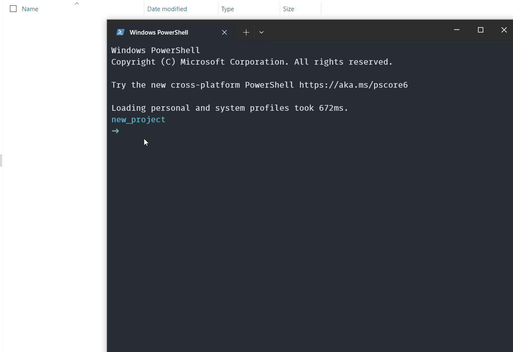

# Template Generator

<p align="center">

</p>


## Running the script

- Running the project

```bash
pnpm start
```

- Running `devsr.bat` from anywhere in window terminal

To run the script `devsr.bat` from anywhere, you need to add the **path to project folder** to the system environment variable `PATH`.

Must be installed:

- Node.js
- tsx [https://tsx.is/](https://tsx.is/) - `npm install -g tsx`

